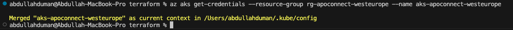

# Kafka Connect Integration and Deployment

This project provides a comprehensive guide for setting up and deploying Kafka Connect in a Kubernetes environment using Terraform. The primary objective is to demonstrate the integration of Kafka with external data sources and customize Kafka Connect for specific data transformation tasks. The deployment leverages Azure Kubernetes Service (AKS) and Azure Blob Storage for practical implementation.

---

## Table of Contents

- [Introduction](#introduction)
- [Technologies and Tools](#technologies-and-tools)
- [Preparation Steps](#preparation-steps)
  - [Infrastructure Setup](#infrastructure-setup)
  - [Cluster Configuration](#cluster-configuration)
- [Kafka Connect Deployment](#kafka-connect-deployment)
  - [Build and Push Docker Image](#build-and-push-docker-image)
  - [Deploy Kafka Components](#deploy-kafka-components)
  - [View Confluent Control Center](#view-confluent-control-center)
- [Kafka Connect Setup](#kafka-connect-setup)
  - [Create Kafka Topics](#create-kafka-topics)
  - [Upload Data to Azure Blob Storage](#upload-data-to-azure-blob-storage)
  - [Configure and Verify Kafka Connect Plugins](#configure-and-verify-kafka-connect-plugins)
- [Summary](#summary)


---

## Introduction

This project demonstrates the deployment and configuration of Kafka Connect, focusing on:
1. Establishing cloud infrastructure using Terraform.
2. Deploying Kafka on Kubernetes with Confluent for Kubernetes.
3. Configuring Kafka Connect to read data from Azure Blob Storage.
4. Applying a transformation to the ingested data.

The assignment provides hands-on experience in managing cloud-native streaming data platforms, ensuring efficient deployment, and implementing transformations.

---

## Technologies and Tools

The following technologies are utilized for completing the project:
- **Apache Kafka**: A distributed platform for event streaming.
- **Kafka Connect**: A connector framework for moving data in and out of Kafka.
- **Terraform**: A tool for infrastructure automation.
- **Kubernetes (AKS)**: For deploying and managing containerized workloads.
- **Azure Blob Storage**: A storage service for large datasets.
- **Confluent Platform**: A production-ready Kafka distribution.
- **Docker**: For creating and managing custom container images.

---

## Preparation Steps

### Infrastructure Setup

1. **Authentication with Azure**:
   Login to Azure for managing resources:
   ```bash
   az login
   ```
2. **Provisioning of Resource Group and Storage**: A resource group and a storage account are created for managing data and state files:
 
   ```bash
   az group create --name terrstate --location westeurope
   az storage account create --name terrstatekafkaconnect --resource-group terrstate --location westeurope
   az storage container create --name terrstatecontainer --account-name terrstatekafkaconnect
   ```

   

3. **Deployment Using Terraform**: Terraform scripts are used for setting up AKS and associated resources:
   ```bash
   terraform init
   terraform plan -out terraform.plan
   terraform apply terraform.plan
   ```
   
   

### Cluster Configuration

1. **Connecting to Kubernetes**:The credentials for the Kubernetes cluster are fetched to manage resources
   ```bash
   az aks get-credentials --resource-group rg-apoconnect-westeurope --name aks-apoconnect-westeurope
   ```
   
2. **Namespace Creation**: Create a dedicated namespace for Kafka resources
   ```bash
   kubectl create namespace confluent-new
   ```
3. **Set Default Namespace**: Configure the namespace as the default for the current context
   ```bash
   kubectl config set-context --current --namespace confluent-new
   ```
4. **Install Confluent for Kubernetes**: The Helm repository is added and Confluent for Kubernetes is installed to simplify and automate the deployment of Kafka and its related components on Kubernetes.
   #### Why Use Helm?
  - **Simplified Deployment**: Helm is a package manager for Kubernetes, allowing users to deploy complex applications like Kafka with a single command.
  - **Reusability**: Helm charts encapsulate configurations and templates, enabling reuse across different environments.
  - **Customizability**: Helm supports parameterization, making it easy to customize deployments based on specific requirements.
  - **Version Management**: Helm allows the management of multiple versions of an application, facilitating rollbacks if needed.

    1. Add the Helm repository for Confluent:
       ```bash
       helm repo add confluentinc https://packages.confluent.io/helm
       ```
    2. Update the Helm repository to fetch the latest charts:
       ```bash
       helm repo update
       ```
    3. Install Confluent for Kubernetes:
       ```bash
       helm upgrade --install kafka-operator confluentinc/confluent-for-kubernetes
       ```
    
    

    Using the Helm chart ensures that Kafka and its components are deployed with production-ready configurations, saving time and reducing complexity.

    #### Why Set the Kubectl Config Context First?

    1. **Correct Namespace Targeting**: Ensures all Helm commands automatically apply to the `confluent-new` namespace, avoiding installation in the default namespace.
    2. **Isolation**: Keeps Kafka resources organized and separated from other applications.
    3. **Simplified Management**: Prevents the need to repeatedly specify the `--namespace` flag in Helm and Kubernetes commands.

## Kafka Connect Deployment

### Build and Push Docker Image

In this step, a custom Docker image for the Azure Blob Storage connector is built and pushed to Docker Hub. This decision was made because pulling the image from Azure Container Registry (ACR) resulted in errors. Instead, Docker Hub is used as the image source in the `.yaml` configuration. Since a Mac M1 (ARM64) system is being used, the image was built for both ARM64 and AMD64 architectures. Due to compatibility issues, the ARM64 architecture image was pulled using its SHA256 hash.

   
   #### Steps to Build and Push the Image

    1. **Navigate to the `connectors` Directory**:    
       ```bash
       cd connectors
       ```
    2. **Build the Docker Image for Multiple Architectures**: Use Docker's buildx to build the image for both ARM64 and AMD64:
       ```bash
       docker buildx create --use
       docker buildx build --platform linux/amd64,linux/arm64 \
         -t dumanapo/my-azure-connector:1.0.0 . --push
       ```
    3. **Verify Image Push to Docker Hub**: Check that the image has been successfully pushed:
       ```bash
       docker pull dumanapo/my-azure-connector:1.0.0
       ```
  


### Deploy Kafka Components

1. **Pull the ARM64 Image**: Since the Mac M1 uses ARM64, the image is referenced by its SHA256 hash in the .yaml file:
       ```yaml
       image: dumanapo/my-azure-connector@sha256:<arm64-sha256-hash>
       ```
2. **Reason for Using Docker Hub**: Pulling the image from Docker Hub resolved issues encountered when pulling from ACR. Despite attempts to use methods like buildx and Rosetta 2 for AMD64 compatibility, these approaches were unsuccessful.

3. **Apply the Updated ```.yaml``` Configuration:**: Deploy the updated configuration to Kubernetes:
       ```bash
       kubectl apply -f confluent-platform.yaml
       kubectl apply -f producer-app-data.yaml
       ```
  
4. **Check that everything is deployed::**:
       ```bash
       kubectl get pods -o wide 
       ```
       By building and pushing the image for both architectures and referencing it by SHA256 hash, compatibility issues on Mac M1 (ARM64) systems were addressed effectively.

      

### View Confluent Control Center

#### Step 1: Access the Confluent Control Center

The Confluent Control Center is a graphical interface for managing and monitoring the Kafka cluster.

1. **Set Up Port Forwarding**:
   Use port forwarding to access the Control Center locally:
   ```bash
   kubectl port-forward controlcenter-0 9021:9021
   ```
   

2. **Open the Control Center**: Access the Control Center via browser:
   ```ardunio
   http://localhost:9021
   ```
  
   

## Kafka Connect Setup

### Create Kafka Topics
A Kafka topic named expedia is created to ingest data from Azure Blob Storage. The topic requires at least 3 partitions since there are 3 partitions in the Azure Blob Storage Dataset. If the Kafka CLI is not available locally, we can execute the command directly inside a Kafka Pod.

##### 1: Enter the Kafka Pod
Access the Kafka Pod using the following command:
```bash
kubectl exec -it kafka-0 -- /bin/bash
```
##### 2: Create the Kafka Topic
Run the command to create the ```expedia``` topic with 3 partitions and a replication factor of 1:
```bash
kafka-topics --create --topic expedia \
    --partitions 3 --replication-factor 1 \
    --bootstrap-server local:9092
```


### Upload Data to Azure Blob Storage

Data was uploaded to Azure Blob Storage using **Microsoft Azure Storage Explorer**. The following steps were performed:

1. **Open Azure Storage Explorer**:
   - The storage container `stkafconnectwesteurope` was selected from the available storage accounts.

2. **Upload Files**:
   - Files were uploaded to the container by selecting the desired directory and dragging the files into the `data`.

   

3. **Verify Upload**:
   - The uploaded data was verified within Azure Storage Explorer to ensure all files were correctly stored.

   


### Configure and Verify Kafka Connect Plugins

This section details the steps for configuring and verifying the Kafka Connect setup, including verifying available plugins, uploading the connector configuration, and checking the connector status.

---

#### Step 1: Verify Available Plugins

Before configuring the connector, ensure that the required plugins are available in the Kafka Connect instance. Run the following command to list all installed connector plugins:
```bash
curl http://localhost:8083/connector-plugins
```

**Expected Output:**

* A list of available plugins, including the Azure Blob Storage Source Connector.


#### Step 2: Upload the Connector Configuration

The connector configuration file (azure-blob-source.json) is uploaded to Kafka Connect via the REST API. This configuration file includes details like the source, destination topic, and transformations to be applied.

Upload the Configuration:

   ```bash
    curl -X POST -H "Content-Type: application/json" \
      --data @azure-source-cc-expedia.json \
      http://localhost:8083/connectors
   ```


#### Step 3: Check Kafka Connect Logs

Logs are useful for debugging and ensuring that the connector is running correctly.

View Logs in Real-Time:

```bash
kubectl logs connect-0 -f
```
#### Step 4: Verify Connector Deployment

Once the configuration is uploaded, check the list of active connectors and their status.

```bash
curl -X GET http://localhost:8083/connectors/expedia/status
```
Expected Output:

    * Status information about the connector, including whether it is running, paused, or failed.

    * Task-level details, such as the number of records processed or any errors encountered.


#### Step 5: Verify Connector Deployment

The message schema defines how data from Azure Blob Storage is structured when sent to the Kafka topic. Verify that the data in the topic matches the expected schema:

    * Fields include: date, time, value, etc.

    * Ensure that the MaskField transformation (e.g., masking timestamps) is applied correctly:

        * Example transformation: 2015-08-18 12:37:10 → 0000-00-00 00:00:00.


## Summary

This project focuses on deploying and configuring **Kafka Connect** in an **Azure Kubernetes Service (AKS)** environment to build a data pipeline for ingesting and transforming data from Azure Blob Storage.

---

### Key Highlights:

#### Infrastructure Setup:
- Provisioned **AKS** and Azure resources using **Terraform**.
- Created a resource group, storage account, and blob container to manage state files and data.

#### Cluster Configuration:
- Configured Kubernetes namespace and context for Kafka.
- Installed **Confluent for Kubernetes** using **Helm** for a production-ready Kafka setup.

#### Kafka Connect Deployment:
- Built and pushed a custom **Docker image** for the Azure Blob Storage Connector.
- Deployed Kafka components and verified their status on Kubernetes.

#### Data Pipeline Setup:
- Created a Kafka topic (`expedia`) to ingest data from Azure Blob Storage.
- Uploaded the dataset to Azure Blob Storage using **Microsoft Azure Storage Explorer**.

#### Connector Configuration:
- Configured and deployed the Azure Blob Storage Source Connector using Kafka Connect REST API.
- Applied a `MaskField` transformation to anonymize timestamp data.

#### Monitoring and Verification:
- Used the **Confluent Control Center** and Kafka Connect logs to monitor the system.
- Verified that data was transformed and ingested successfully.

---

### Outcome:

The project successfully demonstrates a scalable Kafka Connect deployment on AKS with automated infrastructure setup, efficient data ingestion, and transformation. It offers practical experience in managing cloud-native streaming data platforms and integrating Kafka with Azure services.


